# 🥗 NutriLens AI
### *See food differently.*

> An AI-powered nutrition tracking app for India — scan any food, get instant insights, tailored to your health goals.

---

## 📱 Screenshots

  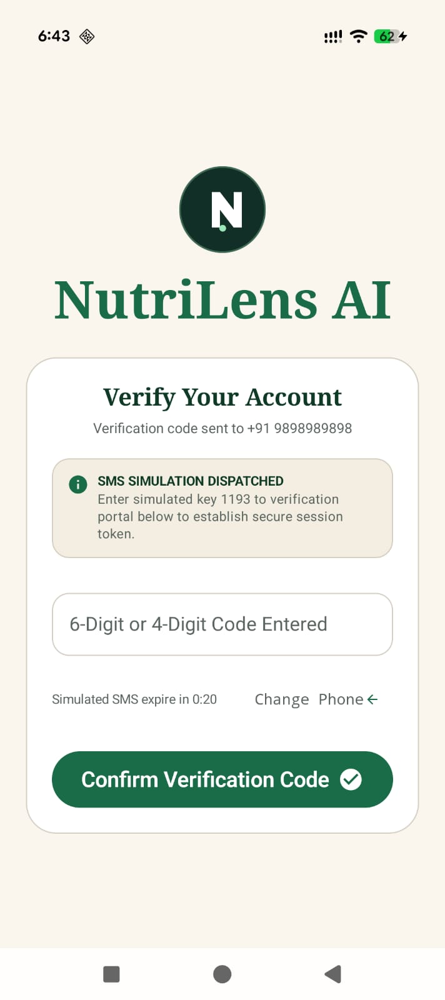
  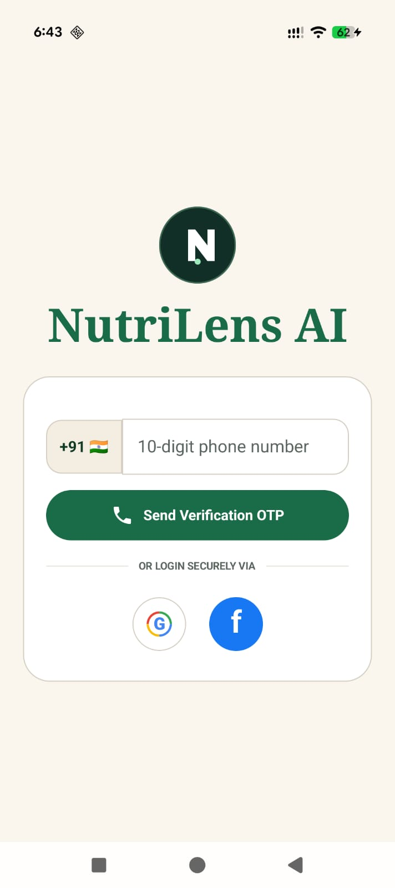
  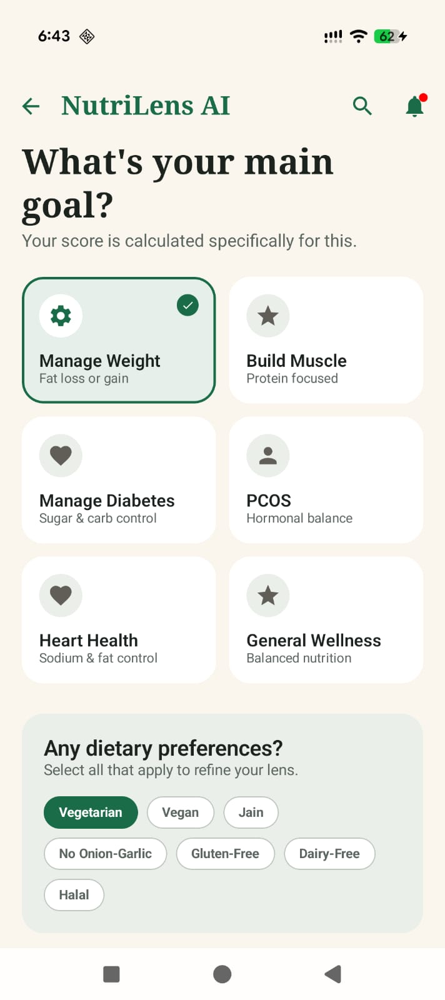
  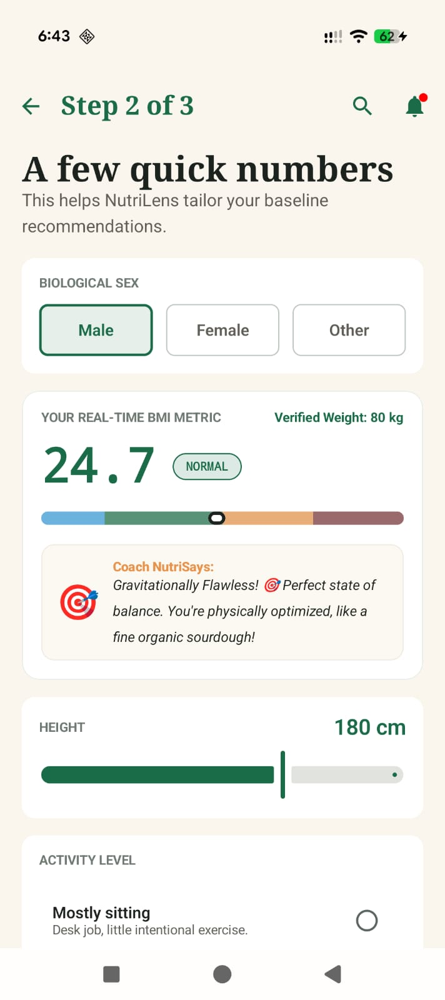
  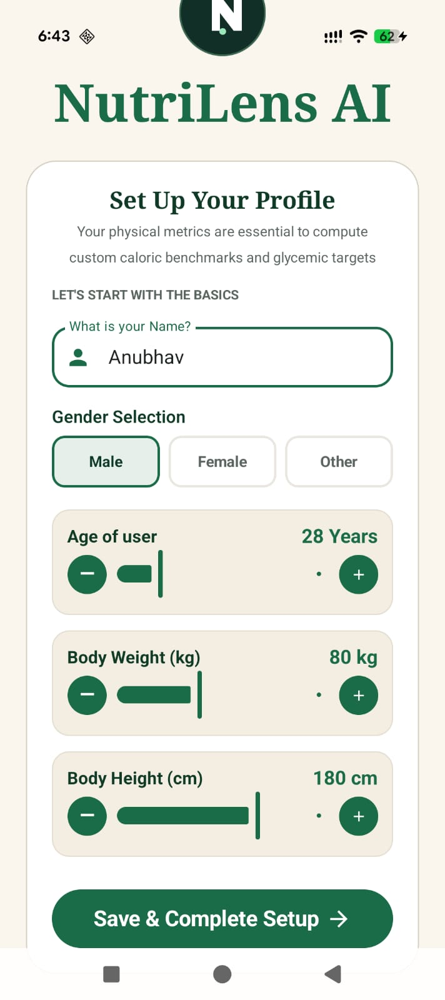

  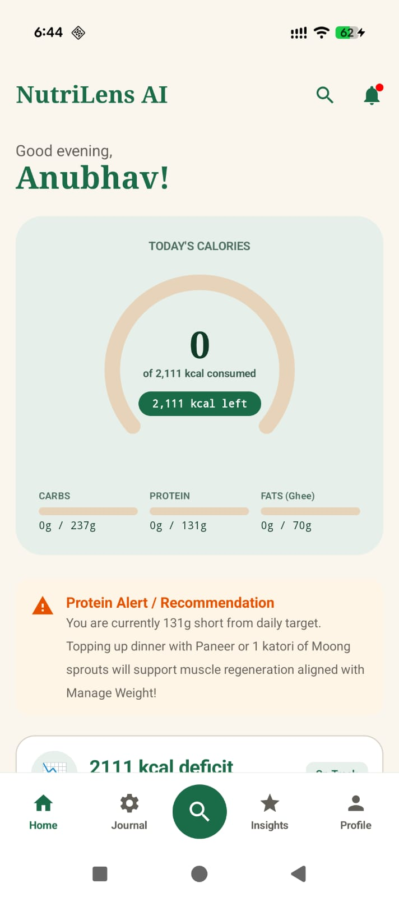
  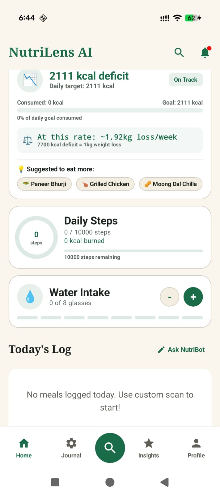
  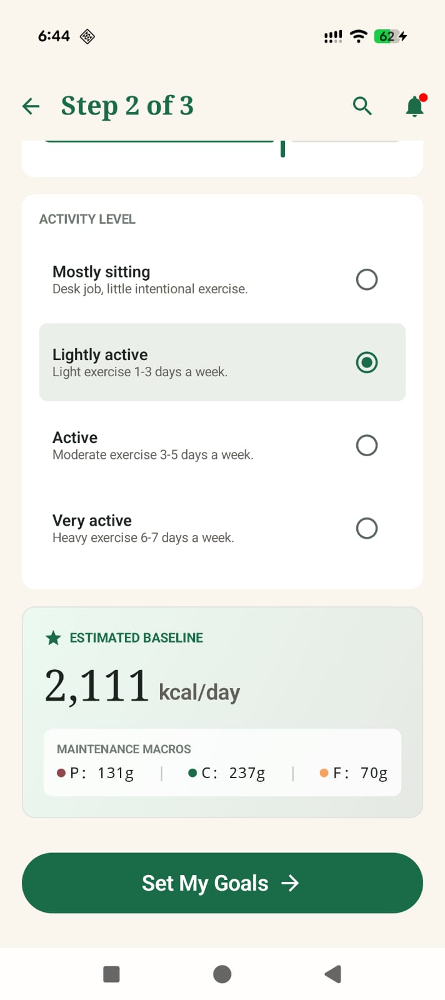
  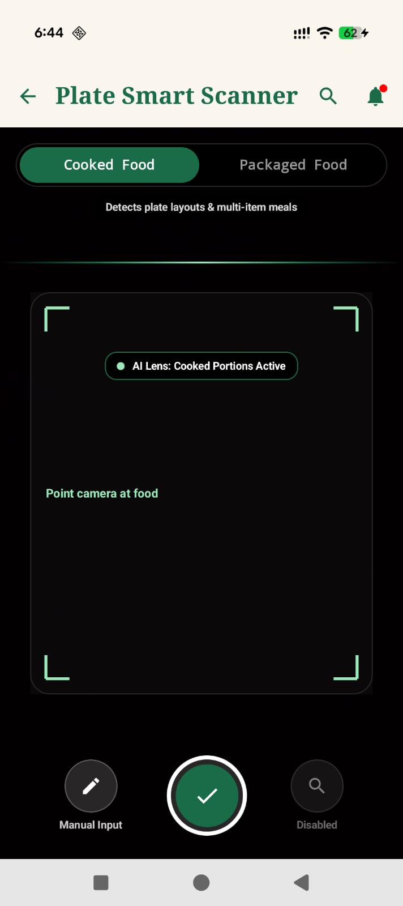
  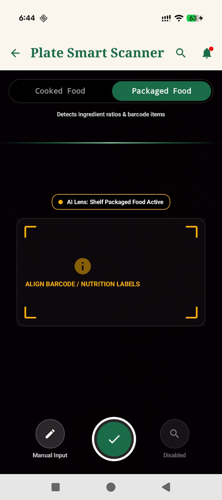

  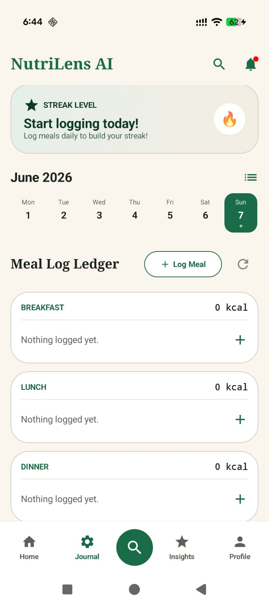
  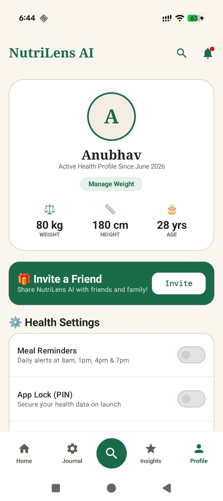
  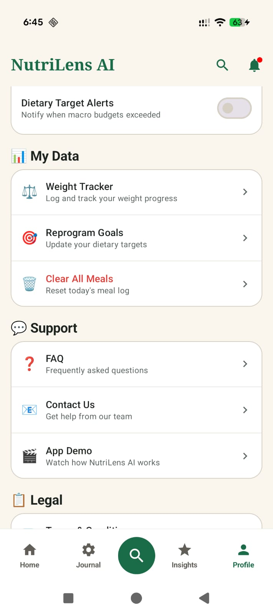
  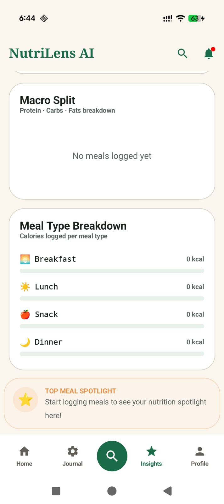
  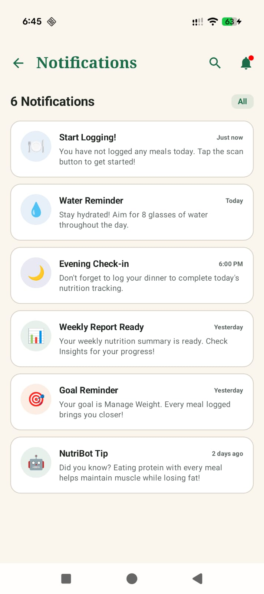
  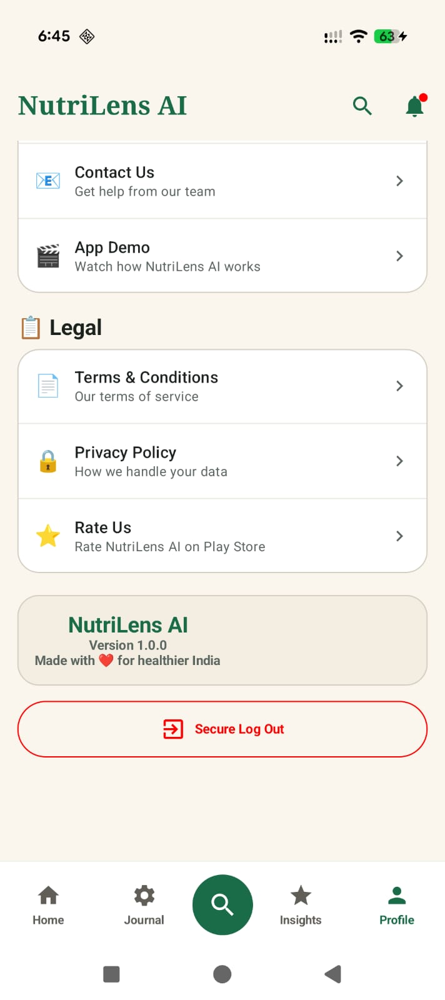

